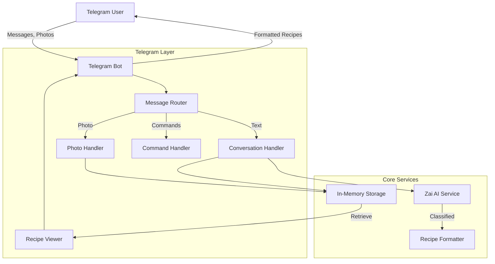
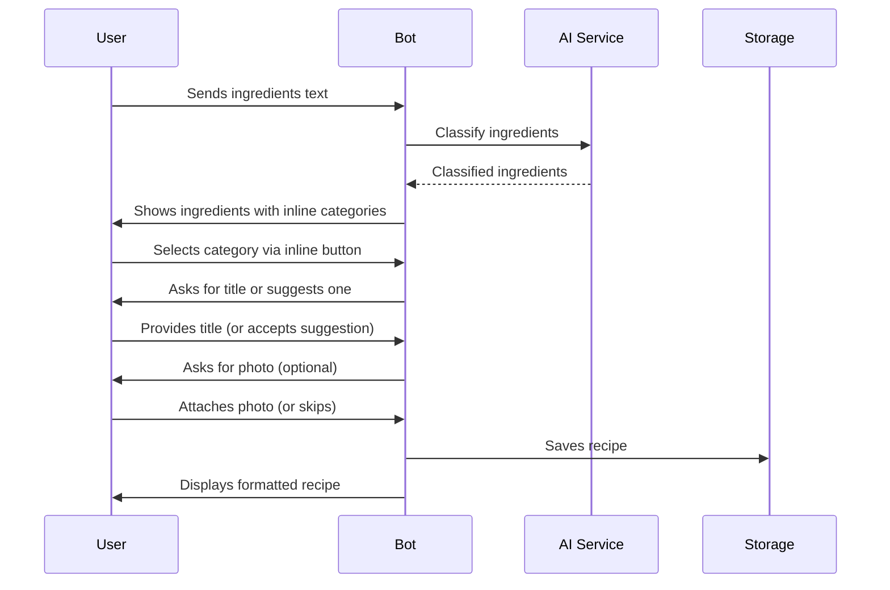
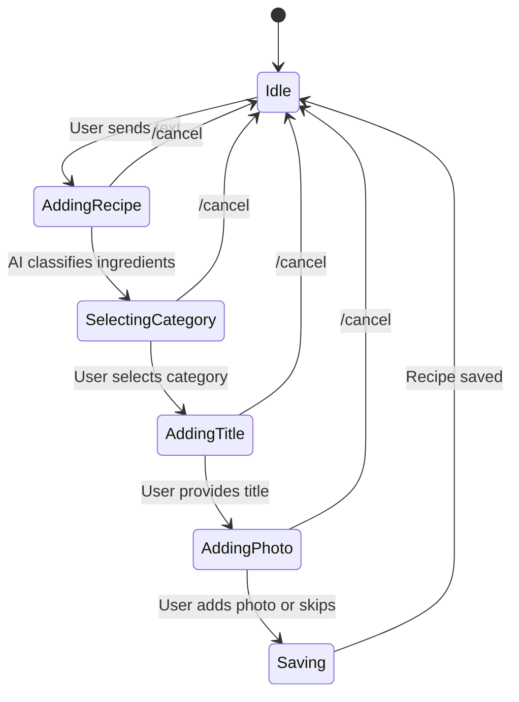

# Telegram Chef Bot - Architecture Plan

## Overview
A Telegram bot that organizes and formats recipes using AI. Users can provide ingredients, attach pictures, and the bot will classify and format recipes with proper categorization.

## Technology Stack
- **Runtime**: Bun
- **Framework**: grammy (Telegram Bot API framework)
- **Language**: TypeScript (strict mode)
- **AI Service**: Zai API (for ingredient classification and recipe formatting)
- **Storage**: In-memory (for MVP, extensible to database)
- **Type Safety**: Full TypeScript coverage with Zai SDK

## System Architecture



## Data Models

### Core Types

```typescript
// Recipe Category
type RecipeCategory = 
  | 'main_course'
  | 'appetizer'
  | 'dessert'
  | 'beverage'
  | 'soup'
  | 'salad'
  | 'breakfast'
  | 'snack'
  | 'other';

// Ingredient
interface Ingredient {
  name: string;
  amount?: string;
  unit?: string;
  classification?: RecipeCategory;
}

// Recipe
interface Recipe {
  id: string;
  userId: number;
  title: string;
  category: RecipeCategory;
  ingredients: Ingredient[];
  instructions?: string;
  photo?: PhotoInfo;
  createdAt: Date;
  updatedAt: Date;
}

// Photo Info
interface PhotoInfo {
  fileId: string;
  fileUniqueId: string;
  width: number;
  height: number;
}

// User Session
interface UserSession {
  userId: number;
  state: 'idle' | 'adding_recipe' | 'selecting_category';
  currentRecipe?: Partial<Recipe>;
  lastMessageId?: number;
}
```

## Component Architecture

### 1. Telegram Bot Layer (`src/bot/`)

#### Bot Initialization
- grammy bot setup with token from environment
- Middleware for session management
- Error handling middleware

#### Message Router
- Routes incoming messages to appropriate handlers
- Distinguishes between commands, text, and photos
- Maintains conversation context

#### Conversation Handler
- Manages conversational flow for recipe creation
- Guides users through recipe entry
- Collects ingredients, title, and other details

#### Photo Handler
- Processes photo attachments
- Stores photo metadata
- Associates photos with recipes

#### Command Handler
- `/start` - Initialize bot and show help
- `/help` - Display usage instructions
- `/myrecipes` - List user's recipes
- `/recipe <id>` - View specific recipe
- `/cancel` - Cancel current operation

#### Recipe Viewer
- Formats recipes for display
- Generates inline keyboards for navigation
- Handles recipe browsing

### 2. AI Service Layer (`src/services/ai.ts`)

#### Zai AI Service
```typescript
interface AIService {
  classifyIngredients(ingredients: string[]): Promise<Ingredient[]>;
  determineCategory(recipe: Partial<Recipe>): Promise<RecipeCategory>;
  formatRecipe(recipe: Partial<Recipe>): Promise<string>;
  suggestTitle(ingredients: Ingredient[]): Promise<string>;
}
```

**Functions:**
- `classifyIngredients()` - Analyzes ingredients and assigns classifications
- `determineCategory()` - Determines recipe category from ingredients
- `formatRecipe()` - Formats recipe text for better readability
- `suggestTitle()` - Generates recipe title suggestions

### 3. Storage Service (`src/services/storage.ts`)

#### In-Memory Storage
```typescript
interface StorageService {
  saveRecipe(recipe: Recipe): Promise<void>;
  getRecipe(id: string): Promise<Recipe | null>;
  getUserRecipes(userId: number): Promise<Recipe[]>;
  updateRecipe(id: string, updates: Partial<Recipe>): Promise<void>;
  deleteRecipe(id: string): Promise<void>;
  getSession(userId: number): UserSession | null;
  setSession(userId: number, session: UserSession): void;
  clearSession(userId: number): void;
}
```

**Data Structures:**
- `Map<string, Recipe>` - Recipe storage by ID
- `Map<number, Recipe[]>` - User recipes index
- `Map<number, UserSession>` - Active user sessions

### 4. Type Definitions (`src/types/`)

All TypeScript interfaces and types in separate files:
- `recipe.ts` - Recipe-related types
- `telegram.ts` - Telegram-specific types
- `ai.ts` - AI service types
- `storage.ts` - Storage types

### 5. Configuration (`src/config/`)

```typescript
interface Config {
  telegramBotToken: string;
  zaiApiKey: string;
  zaiApiEndpoint?: string;
}
```

## Conversation Flow



## User Flow States



## Inline Keyboard Design

### Category Selection
```
┌─────────────┬─────────────┬─────────────┐
│ Main Course │ Appetizer   │ Dessert     │
├─────────────┼─────────────┼─────────────┤
│ Beverage    │ Soup        │ Salad       │
├─────────────┼─────────────┼─────────────┤
│ Breakfast   │ Snack       │ Other       │
└─────────────┴─────────────┴─────────────┘
```

### Recipe Actions
```
┌─────────────┬─────────────┬─────────────┐
│ View Recipe │ Edit Recipe │ Delete      │
└─────────────┴─────────────┴─────────────┘
```

## Error Handling Strategy

1. **Input Validation**
   - Validate ingredient text format
   - Check photo attachment validity
   - Verify user session state

2. **AI Service Errors**
   - Retry logic for API failures
   - Fallback to manual classification
   - Graceful degradation

3. **Storage Errors**
   - Validate recipe IDs
   - Handle duplicate entries
   - Session recovery

4. **User-Facing Messages**
   - Clear error descriptions
   - Recovery suggestions
   - Help command reference

## Security Considerations

1. **API Keys**
   - Store in environment variables
   - Never log or expose
   - Validate at startup

2. **User Data**
   - Isolate recipes by userId
   - No cross-user access
   - Session isolation

3. **Input Sanitization**
   - Escape Markdown in messages
   - Validate file IDs
   - Limit text length

## Performance Optimization

1. **Caching**
   - Cache AI classifications
   - Cache formatted recipes
   - Session caching

2. **Rate Limiting**
   - Limit API calls per user
   - Debounce rapid messages
   - Queue processing

3. **Memory Management**
   - Clean old sessions
   - Limit stored recipes (for MVP)
   - Periodic cleanup

## Testing Strategy

1. **Unit Tests**
   - AI service functions
   - Storage operations
   - Type validators

2. **Integration Tests**
   - Bot message handling
   - Conversation flows
   - Photo processing

3. **E2E Tests**
   - Complete recipe creation
   - Recipe viewing
   - Error scenarios

## Future Enhancements

1. **Database Integration**
   - PostgreSQL/SQLite
   - Recipe search
   - Advanced filtering

2. **Advanced AI Features**
   - Recipe suggestions
   - Nutritional analysis
   - Ingredient substitution

3. **Social Features**
   - Share recipes
   - Import/export
   - Recipe collections

4. **Rich Media**
   - Multiple photos
   - Video support
   - Voice notes

## File Structure

```
telegram-chef/
├── src/
│   ├── bot/
│   │   ├── index.ts           # Bot initialization
│   │   ├── handlers/
│   │   │   ├── conversation.ts
│   │   │   ├── commands.ts
│   │   │   ├── photos.ts
│   │   │   └── viewer.ts
│   │   ├── middleware/
│   │   │   ├── session.ts
│   │   │   └── error.ts
│   │   └── keyboards/
│   │       └── inline.ts
│   ├── services/
│   │   ├── ai.ts              # Zai AI service
│   │   └── storage.ts         # In-memory storage
│   ├── types/
│   │   ├── recipe.ts
│   │   ├── telegram.ts
│   │   ├── ai.ts
│   │   └── storage.ts
│   ├── config/
│   │   └── index.ts
│   └── utils/
│       ├── logger.ts
│       └── validators.ts
├── .env.example
├── package.json
├── tsconfig.json
└── README.md
```

## Implementation Priority

1. **Phase 1: Foundation**
   - Project setup and dependencies
   - Core type definitions
   - Basic bot initialization

2. **Phase 2: Core Services**
   - In-memory storage
   - AI service integration
   - Configuration management

3. **Phase 3: Bot Functionality**
   - Message routing
   - Command handling
   - Basic conversation flow

4. **Phase 4: Advanced Features**
   - Photo handling
   - Inline keyboards
   - Recipe formatting

5. **Phase 5: Polish**
   - Error handling
   - User experience improvements
   - Documentation

## Environment Variables

```bash
# Required
TELEGRAM_BOT_TOKEN=your_bot_token_here
ZAI_API_KEY=your_zai_api_key_here

# Optional
ZAI_API_ENDPOINT=https://api.zai.com/v1
NODE_ENV=development
```

## Dependencies

```json
{
  "dependencies": {
    "grammy": "^1.21.0",
    "zai-sdk": "latest"
  },
  "devDependencies": {
    "@types/bun": "latest",
    "typescript": "^5.0.0"
  }
}
```

## Success Criteria

- ✅ Users can send ingredients as text
- ✅ AI classifies ingredients and suggests categories
- ✅ Users can select categories via inline buttons
- ✅ Users can attach photos to recipes
- ✅ Recipes are formatted and stored
- ✅ Users can view their recipes
- ✅ Full type safety with TypeScript
- ✅ Error handling and user feedback
- ✅ Clear documentation
