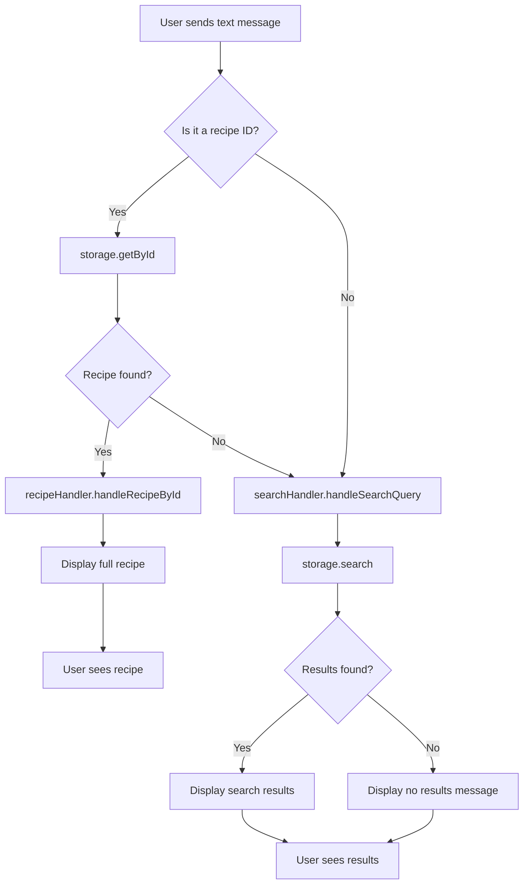

# Recipe ID and Search Handling Implementation Plan

## Overview
Implement intelligent message routing to handle two new user interactions:
1. **Recipe ID lookup**: When user sends a recipe ID, display the full recipe details
2. **Free-form search**: Treat any unknown text as a search query for recipes

## Current State Analysis

### Existing Bot Structure
- Commands: `/recipe`, `/search`, `/list`, `/help`, `/start`
- Handlers: `RecipeHandler`, `SearchHandler`
- Storage: Redis-based with `getById()` and `search()` methods
- Recipe IDs are displayed in format: `<code>${recipe.id}</code>`

### Key Components
- **RecipeHandler**: Handles recipe extraction, listing, and help
- **SearchHandler**: Handles search queries via `/search` command
- **RecipeStorage**: Provides `getById(id)` and `search({ query })` methods

## Implementation Plan

### Step 1: Add Recipe Display Method to RecipeHandler
**File**: [`src/bot/handlers/recipe.ts`](src/bot/handlers/recipe.ts)

Add a new public method `handleRecipeById()` that:
- Takes a recipe ID string as input
- Uses `storage.getById(id)` to retrieve the recipe
- If found, calls the existing `sendRecipeCard()` method
- If not found, returns an appropriate error message

```typescript
async handleRecipeById(ctx: Context, recipeId: string): Promise<void> {
  const recipe = await this.storage.getById(recipeId);
  
  if (!recipe) {
    await ctx.reply(`❌ Recipe with ID "${recipeId}" not found.\n\nUse /list to see all saved recipes.`);
    return;
  }
  
  await this.sendRecipeCard(ctx, recipe);
}
```

### Step 2: Create Message Router
**File**: [`src/bot/index.ts`](src/bot/index.ts)

Add a new handler function that routes text messages:
- Checks if the text matches a recipe ID pattern
- If it's a recipe ID, delegates to `recipeHandler.handleRecipeById()`
- Otherwise, treats it as a search query and delegates to `searchHandler.handleSearchCommand()`

**Recipe ID Detection Logic**:
- Recipe IDs are typically UUIDs or similar identifiers
- Pattern: UUID format `xxxxxxxx-xxxx-xxxx-xxxx-xxxxxxxxxxxx` or similar
- Alternative: Check if the exact text matches any recipe ID in storage

**Implementation Options**:

**Option A: Pattern-based detection**
```typescript
// Check if text matches UUID pattern
const uuidPattern = /^[0-9a-f]{8}-[0-9a-f]{4}-[0-9a-f]{4}-[0-9a-f]{4}-[0-9a-f]{12}$/i;
if (uuidPattern.test(text)) {
  await recipeHandler.handleRecipeById(ctx, text);
  return;
}
```

**Option B: Storage-based detection (Recommended)**
```typescript
// Check if text matches any stored recipe ID
const recipe = await storage.getById(text);
if (recipe) {
  await recipeHandler.handleRecipeById(ctx, text);
  return;
}
```

**Option B is preferred** because:
- More flexible with different ID formats
- No false positives/negatives based on pattern matching
- Directly validates against actual data

### Step 3: Register Catch-All Handler
**File**: [`src/bot/index.ts`](src/bot/index.ts)

Add a catch-all handler for text messages (non-commands):
- Use `bot.on('message:text', ...)` to capture all text messages
- Must be registered **after** command handlers to avoid conflicts
- Implement the routing logic from Step 2

```typescript
// Handle text messages (recipe IDs or search queries)
bot.on('message:text', async (ctx) => {
  const text = ctx.message?.text?.trim();
  if (!text) return;

  // Try to find recipe by ID first
  const recipe = await storage.getById(text);
  if (recipe) {
    await recipeHandler.handleRecipeById(ctx, text);
    return;
  }

  // If not a recipe ID, treat as search query
  await searchHandler.handleSearchCommand(ctx);
});
```

**Important Note**: The search handler expects a `/search <query>` format. We need to either:
- Modify the search handler to accept raw text
- Or create a wrapper that formats the text as a command

**Recommended approach**: Modify the search handler to accept a query parameter directly, or create a new method.

### Step 4: Update SearchHandler for Direct Query
**File**: [`src/bot/handlers/search.ts`](src/bot/handlers/search.ts)

Add a new method `handleSearchQuery()` that:
- Takes a query string directly (without `/search` prefix)
- Reuses existing search logic
- Formats and sends results

```typescript
async handleSearchQuery(ctx: Context, query: string): Promise<void> {
  const trimmedQuery = query.trim();

  if (!trimmedQuery) {
    await ctx.reply('Please provide a search query.');
    return;
  }

  // Search for recipes
  const results = await this.storage.search({ query: trimmedQuery });

  if (results.length === 0) {
    await ctx.reply(`🔍 No recipes found for "${trimmedQuery}".\n\nTry a different search term or add more recipes with /recipe <youtube_url>.`);
    return;
  }

  // Format and send results
  await this.sendSearchResults(ctx, trimmedQuery, results);
}
```

### Step 5: Update Help Text
**File**: [`src/bot/handlers/recipe.ts`](src/bot/handlers/recipe.ts)

Update the `handleHelpCommand()` to document the new behavior:

```typescript
const helpMessage = `
👨‍🍳 <b>Telegram Chef Bot</b>

<b>Available Commands:</b>

/recipe [youtube_url] - Extract recipe from YouTube video
/search [query] - Search for saved recipes
/list - List all saved recipes
/help - Show this help message

<b>Quick Actions:</b>

• Send a <b>recipe ID</b> to view the full recipe details
• Send any <b>text</b> to search for recipes by name or ingredients

<b>How it works:</b>
1. Send a YouTube recipe video link
2. Bot extracts the transcript
3. AI analyzes and extracts recipe details
4. English recipes are translated to Russian
5. Recipe is saved and displayed

<b>Features:</b>
✅ Automatic recipe extraction
✅ Ingredient and instruction parsing
✅ English to Russian translation
✅ Search by name or ingredients
✅ Quick recipe lookup by ID
✅ Redis-based storage
`.trim();
```

### Step 6: Update Bot Initialization
**File**: [`src/bot/index.ts`](src/bot/index.ts)

Final bot initialization with all handlers:

```typescript
// Register commands
bot.command('recipe', (ctx) => recipeHandler.handleRecipeCommand(ctx));
bot.command('search', (ctx) => searchHandler.handleSearchCommand(ctx));
bot.command('list', (ctx) => recipeHandler.handleListCommand(ctx));
bot.command('help', (ctx) => recipeHandler.handleHelpCommand(ctx));
bot.command('start', (ctx) => recipeHandler.handleHelpCommand(ctx));

// Handle text messages (recipe IDs or search queries)
bot.on('message:text', async (ctx) => {
  const text = ctx.message?.text?.trim();
  if (!text) return;

  // Try to find recipe by ID first
  const recipe = await storage.getById(text);
  if (recipe) {
    await recipeHandler.handleRecipeById(ctx, text);
    return;
  }

  // If not a recipe ID, treat as search query
  await searchHandler.handleSearchQuery(ctx, text);
});

// Handle errors
bot.catch((err) => {
  console.error('Bot error:', err);
});
```

## Architecture Diagram



## Edge Cases and Considerations

### 1. Ambiguous Input
- **Issue**: What if a search query happens to match a recipe ID?
- **Solution**: Recipe ID lookup takes priority (more specific intent)
- **User can still**: Use `/search <query>` to force a search

### 2. Empty Messages
- **Issue**: User sends empty text or whitespace
- **Solution**: Handler should return early without action

### 3. Case Sensitivity
- **Issue**: Recipe IDs might be case-sensitive
- **Solution**: Use exact match for IDs, case-insensitive for search

### 4. Multiple Matches
- **Issue**: Search returns multiple results
- **Solution**: Display all results with IDs for easy lookup

### 5. Performance
- **Issue**: Checking every text message against storage
- **Solution**: Redis `getById()` is O(1) operation, minimal overhead

## Testing Checklist

- [ ] Send a valid recipe ID → displays full recipe
- [ ] Send an invalid recipe ID → shows not found message
- [ ] Send a search query → shows matching recipes
- [ ] Send a query with no matches → shows no results message
- [ ] Send empty text → no action taken
- [ ] Use `/search <query>` → still works as before
- [ ] Use `/list` → still works as before
- [ ] Use `/recipe <url>` → still works as before
- [ ] Help command shows updated documentation

## Files to Modify

1. **[`src/bot/handlers/recipe.ts`](src/bot/handlers/recipe.ts)**
   - Add `handleRecipeById()` method
   - Update `handleHelpCommand()` text

2. **[`src/bot/handlers/search.ts`](src/bot/handlers/search.ts)**
   - Add `handleSearchQuery()` method

3. **[`src/bot/index.ts`](src/bot/index.ts)**
   - Add catch-all text message handler
   - Implement routing logic

## Summary

This implementation provides a seamless user experience:
- Users can quickly view recipes by clicking or typing the ID
- Any text input automatically triggers a search
- Existing commands continue to work as before
- Minimal code changes required
- Leverages existing storage and handler infrastructure
