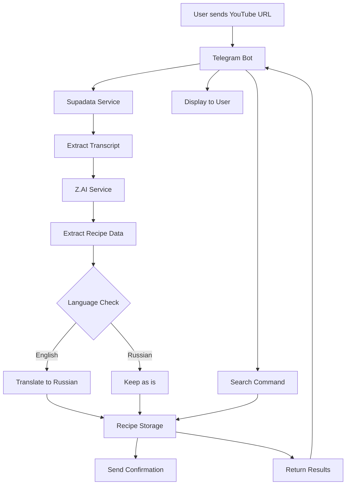
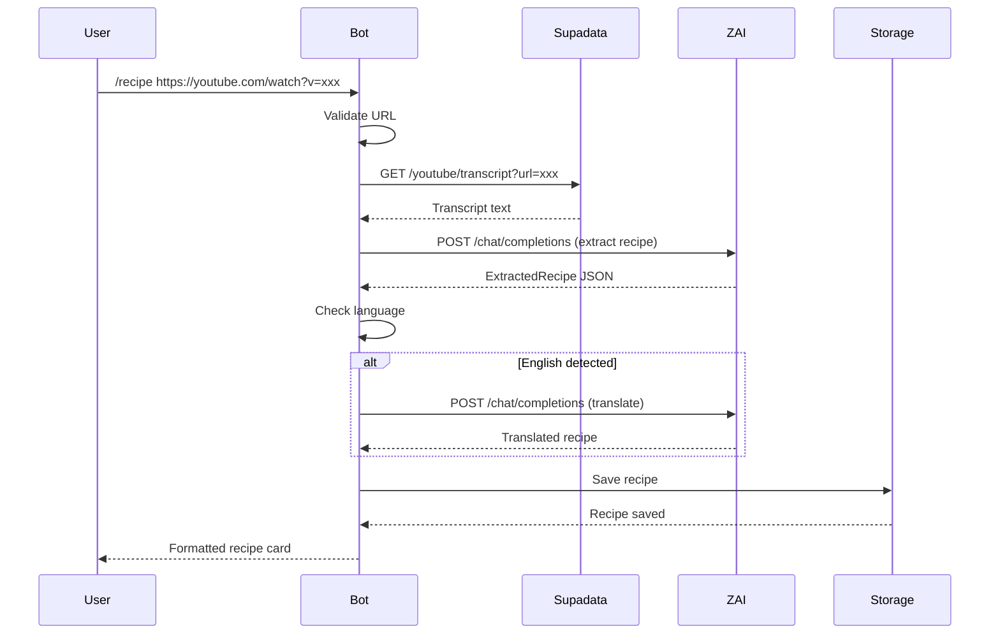
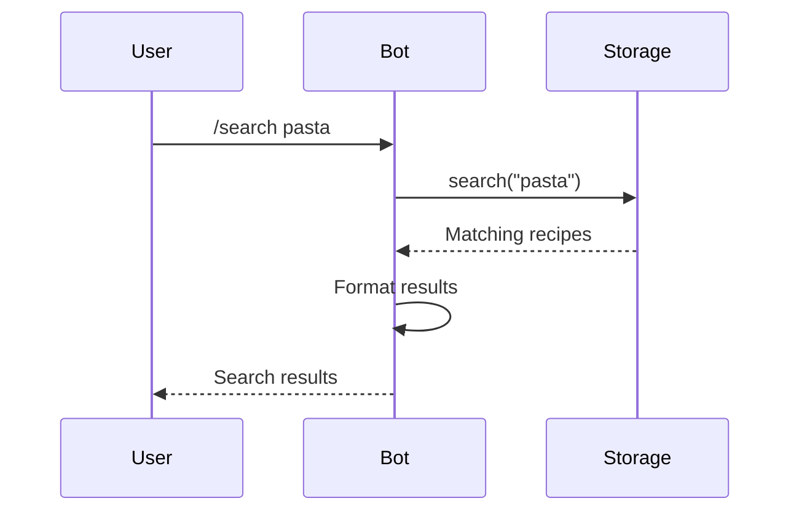

# YouTube Recipe Extraction & Translation Feature Plan

## Overview
Build a Telegram bot that accepts YouTube recipe video links, extracts transcriptions using Supadata API, processes them with Z.AI to extract structured recipe information, translates to Russian if needed, and stores recipes in memory with search capabilities.

## System Architecture



## Project Structure

```
telegram-chef/
├── src/
│   ├── bot/
│   │   ├── index.ts              # Main bot initialization
│   │   ├── handlers/
│   │   │   ├── recipe.ts         # Recipe command handlers
│   │   │   └── search.ts         # Search command handlers
│   │   └── commands.ts           # Command definitions
│   ├── services/
│   │   ├── supadata.ts           # YouTube transcript extraction
│   │   ├── ai.ts                 # Z.AI integration
│   │   └── storage.ts            # In-memory recipe storage
│   ├── types/
│   │   └── recipe.ts             # Recipe type definitions
│   └── config/
│       └── index.ts              # Configuration management
├── plans/
│   └── youtube-recipe-extraction.md
├── .env.example
├── package.json
├── tsconfig.json
└── index.ts
```

## Component Details

### 1. Types & Interfaces (`src/types/recipe.ts`)

Define the data structures for recipes:

```typescript
interface Recipe {
  id: string;
  name: string;
  cookingTime: string;
  ingredients: string[];
  instructions: string[];
  originalLanguage: 'en' | 'ru';
  youtubeUrl: string;
  transcript: string;
  createdAt: Date;
}

interface ExtractedRecipe {
  name: string;
  cookingTime: string;
  ingredients: string[];
  instructions: string[];
  detectedLanguage: 'en' | 'ru';
}

interface TranscriptResponse {
  content: string | TranscriptChunk[];
  lang: string;
  availableLangs: string[];
}

interface TranscriptChunk {
  text: string;
  offset: number;
  duration: number;
  lang: string;
}
```

### 2. Configuration (`src/config/index.ts`)

Centralized configuration management:

```typescript
interface Config {
  telegramBotToken: string;
  zaiApiKey: string;
  zaiApiEndpoint: string;
  supadataApiKey: string;
  supadataApiEndpoint: string;
  nodeEnv: string;
}
```

### 3. Supadata Service (`src/services/supadata.ts`)

**Purpose**: Extract transcripts from YouTube videos

**API Details**:
- Endpoint: `GET /youtube/transcript`
- Base URL: `https://api.supadata.ai/v1`
- Authentication: API Key via query parameter or header

**Key Features**:
- Accept YouTube URL or video ID
- Return plain text or structured chunks with timestamps
- Support multiple languages
- Error handling for unavailable transcripts

**Methods**:
- `getTranscript(url: string): Promise<string>` - Extract plain text transcript
- `getStructuredTranscript(url: string): Promise<TranscriptResponse>` - Get transcript with timestamps

### 4. Z.AI Service (`src/services/ai.ts`)

**Purpose**: Extract structured recipe data from transcript and translate to Russian

**API Details**:
- Endpoint: `POST /api/paas/v4/chat/completions`
- Base URL: `https://api.z.ai/api/paas/v4`
- Model: `glm-4.7`
- Headers: `Authorization: Bearer KEY`, `Content-Type: application/json`, `Accept-Language: en-US,en`

**Key Features**:
- Parse transcript to extract recipe components
- Detect language of recipe
- Translate English recipes to Russian
- Return structured JSON response

**Methods**:
- `extractRecipe(transcript: string): Promise<ExtractedRecipe>` - Extract recipe data
- `translateToRussian(recipe: ExtractedRecipe): Promise<ExtractedRecipe>` - Translate recipe
- `processRecipe(transcript: string): Promise<Recipe>` - Complete extraction and translation pipeline

**System Prompt for Recipe Extraction**:
```
You are a professional cooking assistant. Analyze the following YouTube video transcript and extract recipe information in JSON format:

{
  "name": "Recipe name",
  "cookingTime": "Time to cook (e.g., '30 minutes', '1 hour')",
  "ingredients": ["ingredient 1", "ingredient 2", ...],
  "instructions": ["step 1", "step 2", ...],
  "detectedLanguage": "en" or "ru"
}

Rules:
- Extract only recipe-related information
- Be precise with measurements
- Format cooking time clearly
- Detect if the recipe is in English or Russian
- Return valid JSON only, no additional text
```

**System Prompt for Translation**:
```
You are a professional translator. Translate the following recipe from English to Russian. Return the result in the same JSON format:

{
  "name": "Translated name",
  "cookingTime": "Translated time",
  "ingredients": ["Translated ingredient 1", ...],
  "instructions": ["Translated step 1", ...],
  "detectedLanguage": "ru"
}

Rules:
- Maintain the same JSON structure
- Translate all text fields
- Keep measurements and numbers unchanged
- Use natural Russian cooking terminology
- Return valid JSON only
```

### 5. Storage Service (`src/services/storage.ts`)

**Purpose**: In-memory storage for recipes with search capabilities

**Data Structure**:
```typescript
class RecipeStorage {
  private recipes: Map<string, Recipe>;
  
  add(recipe: Recipe): void;
  getById(id: string): Recipe | undefined;
  getAll(): Recipe[];
  search(query: string): Recipe[];
  delete(id: string): boolean;
  clear(): void;
}
```

**Search Features**:
- Search by recipe name (case-insensitive)
- Search by ingredients
- Fuzzy search support
- Return all matching recipes

### 6. Telegram Bot (`src/bot/`)

**Commands**:
- `/recipe <youtube_url>` - Extract and save recipe from YouTube
- `/search <query>` - Search for saved recipes
- `/list` - List all saved recipes
- `/help` - Show available commands

**Handler Details**:

#### Recipe Handler (`src/bot/handlers/recipe.ts`)
1. Validate YouTube URL
2. Extract transcript using Supadata
3. Process transcript with Z.AI
4. Detect language and translate if needed
5. Save to storage
6. Send formatted recipe to user

#### Search Handler (`src/bot/handlers/search.ts`)
1. Parse search query
2. Search in storage
3. Format results
4. Send to user with pagination if needed

## Data Flow

### Recipe Extraction Flow



### Search Flow



## Error Handling Strategy

### YouTube URL Validation
- Check URL format
- Validate video ID extraction
- Handle unsupported URL formats

### Supadata Errors
- Video not found
- Transcript unavailable
- Rate limiting
- API key issues

### Z.AI Errors
- Invalid API response
- JSON parsing errors
- Translation failures
- Rate limiting

### Storage Errors
- Duplicate recipe detection
- Invalid data format
- Memory limits

### User Feedback
- Clear error messages
- Helpful suggestions
- Progress indicators for long operations

## Message Formatting

### Recipe Card Format
```
🍽️ *Recipe Name*
⏱️ Cooking Time: 30 minutes

📝 *Ingredients:*
• Ingredient 1
• Ingredient 2
• Ingredient 3

👨‍🍳 *Instructions:*
1. Step one
2. Step two
3. Step three

📺 Source: YouTube video
🌐 Language: Russian
```

### Search Results Format
```
🔍 Found 3 recipes for "pasta":

1. *Spaghetti Carbonara*
   ⏱️ 20 minutes
   📝 5 ingredients

2. *Pasta Alfredo*
   ⏱️ 25 minutes
   📝 6 ingredients

3. *Pasta Primavera*
   ⏱️ 30 minutes
   📝 8 ingredients
```

## Environment Variables

Required environment variables (already in `.env.example`):
- `TELEGRAM_BOT_TOKEN` - Telegram bot token
- `ZAI_API_KEY` - Z.AI API key
- `ZAI_API_ENDPOINT` - Z.AI API endpoint
- `SUPADATA_API_KEY` - Supadata API key
- `SUPADATA_API_ENDPOINT` - Supadata API endpoint
- `NODE_ENV` - Environment (development/production)

## Dependencies

Current dependencies:
- `grammy` - Telegram bot framework
- `openai` - OpenAI SDK (can be used for Z.AI compatibility)

Additional dependencies needed:
- `zod` - Schema validation (optional, for robust type checking)
- `date-fns` - Date formatting (optional)

## Testing Strategy

### Unit Tests
- Supadata service transcript extraction
- Z.AI service recipe extraction
- Z.AI service translation
- Storage service CRUD operations
- Storage service search functionality

### Integration Tests
- Complete recipe extraction flow
- Search functionality
- Error handling scenarios

### Manual Testing Checklist
- [ ] Valid YouTube URL with English recipe
- [ ] Valid YouTube URL with Russian recipe
- [ ] Invalid YouTube URL
- [ ] Video without transcript
- [ ] Search by recipe name
- [ ] Search by ingredient
- [ ] Empty search results
- [ ] Multiple recipes with similar names
- [ ] Large transcript handling
- [ ] API rate limiting

## Performance Considerations

1. **Transcript Extraction**: Can be slow for long videos
   - Consider adding timeout
   - Show progress to user

2. **AI Processing**: May take several seconds
   - Implement async processing
   - Send intermediate messages

3. **Storage**: In-memory storage is fast but limited
   - Monitor memory usage
   - Consider cleanup for old recipes

4. **Search**: Linear search through all recipes
   - Optimize with indexing if needed
   - Implement pagination for large result sets

## Security Considerations

1. **API Keys**: Never expose in code
   - Use environment variables
   - Validate at startup

2. **Input Validation**: Sanitize all user inputs
   - YouTube URLs
   - Search queries

3. **Rate Limiting**: Protect against abuse
   - Limit requests per user
   - Implement cooldown periods

4. **Error Messages**: Don't expose sensitive information
   - Generic error messages for users
   - Detailed logs for debugging

## Future Enhancements

1. **Persistent Storage**: Add database support
2. **Recipe Categories**: Tag and categorize recipes
3. **Recipe Sharing**: Share recipes with other users
4. **Recipe Editing**: Allow users to edit extracted recipes
5. **Multiple Languages**: Support more languages
6. **Recipe Images**: Extract thumbnails from YouTube
7. **Recipe Export**: Export recipes as PDF or text
8. **Recipe Import**: Import from other sources
9. **User Favorites**: Save favorite recipes
10. **Recipe Ratings**: Rate and review recipes

## Implementation Order

1. ✅ Gather project context and API documentation
2. ⏳ Create project structure and configuration files
3. ⏳ Implement types and interfaces for recipe data
4. ⏳ Implement Supadata service for YouTube transcript extraction
5. ⏳ Implement Z.AI service for recipe extraction and translation
6. ⏳ Create in-memory recipe storage service
7. ⏳ Implement Telegram bot with recipe commands
8. ⏳ Add recipe search functionality
9. ⏳ Add error handling and validation
10. ⏳ Test the complete workflow

## Notes

- The AI_INTEGRATION_FIX.md document provides corrected Z.AI API configuration
- Use `glm-4.7` model for Z.AI
- Include `Accept-Language: en-US,en` header in all Z.AI requests
- Supadata returns transcript as plain text or structured chunks
- In-memory storage will lose data on bot restart (as requested)
- All English recipes will be translated to Russian automatically
